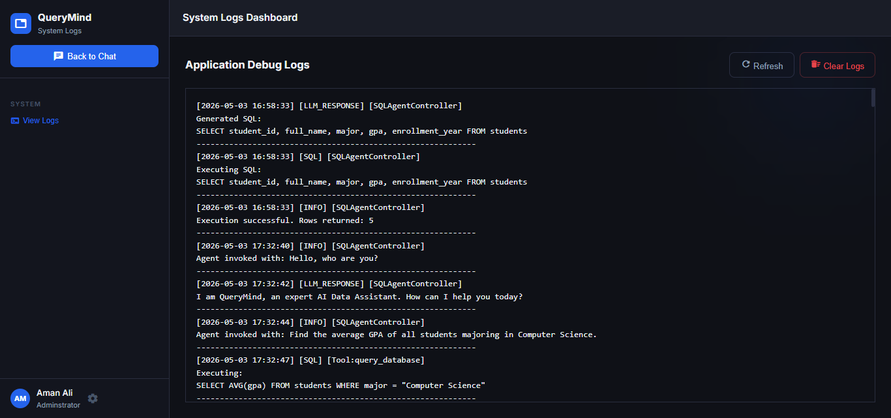

<div align="center">
  <h1>🚀 QueryMind AI SQL Agent</h1>
  <p><em>Transform your data conversations with an autonomous, AI-driven SQL engineering system.</em></p>

  <p>
    
    
    
    
  </p>
</div>

---

## 📖 Overview

**QueryMind** is a production-ready, autonomous data engineering system designed for the **Programming for AI** semester end project. It allows users to interact with multiple databases and documents using natural language. Whether you're querying complex SQL tables, indexing RAG documents, or generating intelligent visualizations, QueryMind handles the heavy lifting autonomously.

### 📸 Screenshots

<div align="center">
  
  <p><em>Modern Chat Interface with Real-time SQL Generation</em></p>
</div>

<div align="center">
  
  <p><em>Autonomous System Logger Tracking Agent Activities</em></p>
</div>

---

## ✨ Features

- 🤖 **Autonomous SQL Agent** — Converts natural language to complex SQL queries with automatic execution and validation.
- 📂 **Multi-Database Support** — Seamlessly switch between multiple SQLite databases via a dynamic sidebar switcher.
- 📄 **Advanced RAG System** — Index and query PDF and PPTX documents using FAISS and Google Gemini embeddings.
- 📊 **Intelligent Visualization** — Automatically selects and generates Bar, Line, Pie, or Scatter charts based on query results.
- 🚀 **Robust File Ingestion** — Fault-tolerant CSV and Excel uploading with automatic column cleaning and engine fallbacks.
- 🛡️ **API Resilience** — Built-in API key rotation and fallback system to handle rate limits (429 errors) gracefully.
- 📜 **Live System Logs** — Dedicated logging interface to monitor background agent processes and tool calls.

---

## 🛠️ Tech Stack

- **Core:** Python, Flask
- **AI/LLM:** Google Gemini 1.5 (Pro/Flash), LangChain
- **Data Engine:** Pandas, SQLAlchemy, SQLite
- **Vector Store:** FAISS (for RAG)
- **Visualization:** Plotly.js
- **Styling:** Vanilla CSS (Modern Dark Mode / Glassmorphism)

---

## 🚀 Getting Started

### 1. Prerequisites
- Python 3.10+
- A Google Gemini API Key

### 2. Installation

```bash
# Clone the repository
git clone https://github.com/aman-ali65/AI-Driven-SQL-Agent
cd AI-Driven-SQL-Agent

# Install dependencies
pip install -r requirements.txt
```

### 3. Configuration

1. Create a file named `api.txt` in the root directory.
2. Add your Gemini API keys (one per line) for automatic rotation:
   ```text
   YOUR_API_KEY_1
   YOUR_API_KEY_2
   ```

### 4. Running the App

```bash
python app.py
```
Open [http://localhost:5000](http://localhost:5000) in your browser.

---


<div align="center">
  <p>This project was developed for the <b>Programming for AI</b> semester end project.</p>
  <p>Developed with ❤️ for the AI Community</p>
</div>